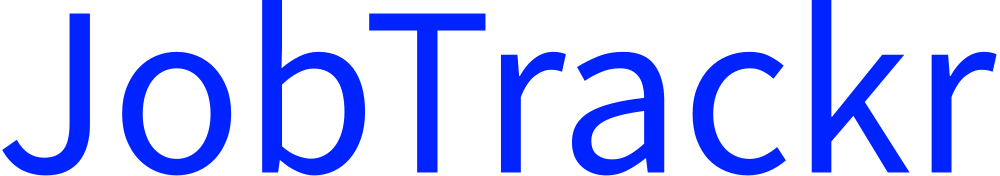

<div id="top"></div>


<!-- PROJECT LOGO -->
<div align="center">
  <br>
  <a href= "https://jobtrackr.onrender.com">
    
  </a>
  <br>
  <br>
</div>

<!-- TABLE OF CONTENTS -->
<details>
  <summary>Table of Contents</summary>
  <ol>
    <li>
      <a href="#about-the-project">About The Project</a>
      <ul>
        <li><a href="#features">Features</a></li>
        <li><a href="#work-in-progress"> Work in Progress</a></li>
        <li><a href="#technologies-used">Technologies Used</a></li>
        <li><a href="#users">Users</a></li>
      </ul>
    </li>
    <li>
      <a href="#getting-started">Getting Started</a>
      <ul>
        <li><a href="#installation">Installation</a></li>
      </ul>
    </li>
    <li><a href="#contributing">Contributing</a></li>
    <li><a href="#license">License</a></li>
    <li><a href="#contact">Contact</a></li>
  </ol>
</details>

## About The Project

JobTrackr is a comprehensive full-stack web application designed to streamline and organize the job application process. With TrackMyJob, users can easily track their job applications and monitor the progress of their job search.


### Features

1. User-friendly interface: TrackMyJob provides a clean and intuitive user interface that allows users to easily manage their job applications.
2. Dashboard: Users can add job postings to their dashboard and track the status of each application at a glance.
3. Application details: Users can store important information about each job application, such as job title, company name, application status, salary, and more.
4. Search and filter: Users can search and filter their job applications based on various criteria, making it easy to find and manage specific applications.
5. Authentication and authorization: TrackMyJob uses JWT-based authentication and authorization to ensure secure access to user accounts and data.

## Work in Progress

JobTrackr is currently under active development, and there are some features that are still being added or improved, and some bugs that are being addressed.

- Search Filter: I am working on implementing a search functionality that allows users to search and filter their job applications based on various criteria, such as job title, company name, or application status.
- Stats Page: I am developing a stats page that will provide users with insightful visualizations and statistics related to their job applications, such as the number of applications submitted, the status distribution, or the average salary.
- Document : Document page to upload and attach files related to job applications.

I appreciate your patience as I am working on these features. Contributions and suggestions are always welcome!

If you have any ideas for additional features or would like to contribute to the development of these features, please refer to the "Contributing" section for instructions on how to get started.

## Technologies Used
  TrackMyJob is built using the following technologies:

### Front-end:

- React.js for building the user interface
- Redux for state management
- Axios for API communication

### Back-end:

- Node.js for server-side development
- Express.js for building the RESTful API
- MongoDB for the database

### Other tools and libraries:

- Styled Components for UI components
- Moment.js for date and time manipulation
- Bcrypt for password hashing
- JSON Web Tokens (JWT) for secure authentication

## Users

| Email              | Password |
| ------------------ | -------- |
| david@gmail.com    | 654321   |

<!-- GETTING STARTED -->

## Getting Started

This project requires some prerequisites and dependencies to be installed. You can view it online using this [demo](https://jobify-abdelrahman-soltan.up.railway.app/) or follow the instructions below to get a local copy:

### Installation

#### Installing Locally

1. Clone the repository:

   ```sh
   git clone https://github.com/samarthshete/job-app-mern   ```

2. go to project folder

   ```sh
   cd job-app-mern
   ```

3. install dependencies

   ```bash
   npm run install
   ```

4. Environmental Variables Set up

   - Here are the environmental variables that needs to be set in the `.env` file in the **server directory**.
   - These are the default setting that I used for development, but you can change it to what works for you.

   ```
     PORT=5000
     MONGO_URL=<Your mongodb url>
     JWT_LIFETIME=1d
     JWT_SECRET=<any secret value of your choice>
   ```

5. Run development server

   ```sh
   npm start
   ```
<p align="right">(<a href="#top">back to top</a>)</p>

---

<!-- CONTRIBUTING -->

## Contributing

Contributions are what make the open source community such an amazing place to learn, inspire, and create. Any contributions you make are **greatly appreciated**.

If you'd like to contribute to the project, please follow these steps:

1. Fork the repository.
2. Create a new branch: `git checkout -b feature/your-feature-name`
3. Make your changes and commit them: `git commit -m 'Add some feature'`
4. Push to the branch: `git push origin feature/your-feature-name`
5. Submit a pull request.


## License
This project is licensed under the MIT License.

## Contact
For any questions or inquiries, please reach out to:

- Email: samarthshete14@gmail.com
- LinkedIn: <a href="https://www.linkedin.com/in/samarthshete14/">Samarth Shete</a>

Feel free to contact me through email or connect with me on LinkedIn. I am happy to answer any questions or discuss potential collaborations.

Good luck with your project and your job search!

<p align="right">(<a href="#top">back to top</a>)</p>
